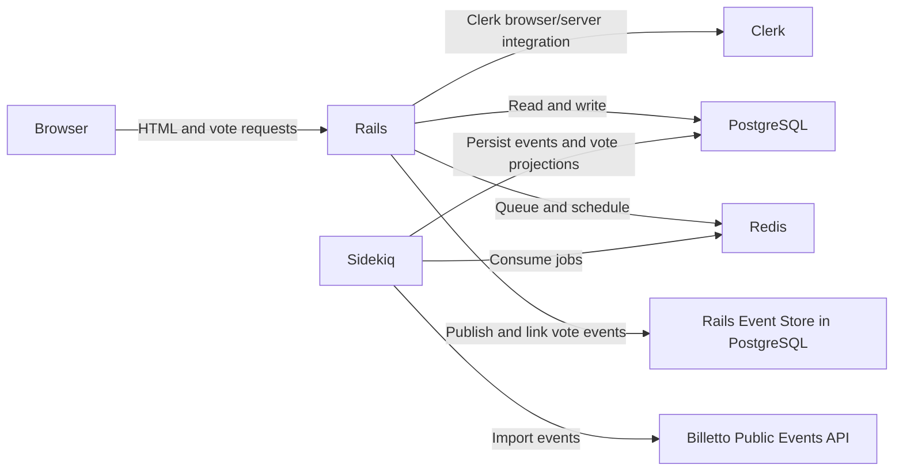

# System Design

This document describes the current implementation and its main runtime
decisions. Setup instructions and environment variables are documented in
[README.md](./README.md).

## Goals

- Import and persist public Billetto event information.
- Present events in start-time order, including past events with a visual
  indication that they have passed.
- Allow authenticated users to cast upvotes and downvotes.
- Retain an event history for votes and maintain fast-to-read vote totals.
- Run imports and stale-event cleanup without requiring a web request.

## System context

The web process serves the Rails UI and accepts vote requests. A separate
Sidekiq process is responsible for scheduled work. PostgreSQL stores event
records and Rails Event Store data; Redis provides Sidekiq's queue and schedule
backend. Clerk provides user identity and browser sign-in.

## Components

| Component | Responsibility |
| --- | --- |
| `EventsController` and event views | List events ordered by `starts_at` and display event details |
| `Billetto::Client` | Make paginated API requests using the Billetto API keypair |
| `Billetto::EventImporter` | Validate API event data and upsert the local event read model |
| `Billetto::ImportEventsJob` | Invoke the importer from Sidekiq |
| `Billetto::DeleteOldEventsJob` | Remove event rows more than 30 days past their start time |
| `VotesController` | Require a signed-in user and publish valid vote events |
| Rails Event Store | Persist vote domain events and their event/user stream links |
| `VoteCounterProjector` | Update denormalized vote counts on event rows |
| Clerk | Provide the browser sign-in experience and server-side identity integration |

## Data model and persistence

### Event read model

The `events` table contains Billetto identifiers, title, description, image and
event URLs, start/end timestamps, organizer and location data, categories,
availability, the raw API payload, and the last synchronization time. Vote
counts are stored as non-null integer columns (`upvotes_count` and
`downvotes_count`).

`billetto_id` has a unique index. Imports use an upsert keyed by this index,
which makes repeated imports update existing event records instead of creating
duplicates. `starts_at` is indexed to support ordering and cleanup.

The `Event` model derives `total_votes` and `net_score` from the two vote
counters. Past events are retained in the list and distinguished by the view;
cleanup, rather than the list query, eventually removes old records.

### Vote event store

Votes are stored as immutable `EventUpvoted` or `EventDownvoted` domain events
in Rails Event Store's PostgreSQL tables. Each vote is published to the
`Event$<event-id>` stream and linked into the `User$<clerk-user-id>` stream.
The event stream represents activity associated with an event, while the user
stream provides an audit trail of a user's votes.

The `events` table also acts as a read model: `VoteCounterProjector` increments
the relevant count when it receives a vote event. This keeps list rendering
simple and avoids replaying the event stream for every page request.

## Request and data flows

### Importing events

1. Sidekiq runs `Billetto::ImportEventsJob`, or an operator invokes
   `bin/rails billetto:import_events`.
2. `Billetto::EventImporter` obtains `BILLETTO_API_KEYPAIR` and creates a
   `Billetto::Client`.
3. The client requests up to 100 events per page from the public events API,
   sends the keypair in the `Api-Keypair` header, and parses JSON responses.
4. The importer validates required fields, maps API fields to the event read
   model, stores the raw payload, and upserts by `billetto_id`.
5. Import and API failures are raised and reported by the job/task rather than
   being treated as a successful empty import.

### Viewing events

1. `GET /` and `GET /events` query the event table ordered by `starts_at`.
2. Each event uses the shared event-card partial for its display.
3. An event whose `starts_at` is earlier than the current application time is
   marked as past. The event remains available in the list until cleanup
   removes it.
4. `GET /events/:id` renders the selected event detail using that same partial.

### Voting

1. The browser sends `POST /events/:event_id/votes` with `type=upvote` or
   `type=downvote`.
2. The controller requires an authenticated Clerk user, finds the target event,
   and rejects any other vote type.
3. It creates the corresponding domain event with the event ID, Clerk user ID,
   and vote timestamp.
4. Rails Event Store publishes the event on the event stream and links it to
   the user's stream.
5. The registered `VoteCounterProjector` updates the event's denormalized
   counter.

### Scheduled cleanup

`Billetto::DeleteOldEventsJob` deletes rows where `starts_at` is earlier than
30 days before the job's execution time. It runs daily at 02:00 in
`Asia/Kolkata`. The cleanup is based on the event start time, not
`last_synced_at`.

## Runtime and scheduling

The production deployment has two long-running processes built from the same
image:

- **Web:** runs Rails/Puma behind Thruster and prepares the database on startup.
- **Worker:** runs Sidekiq with `config/sidekiq.yml`, consuming the default
  queue and registering the recurring schedules.

Redis and PostgreSQL must be reachable from both processes. The Sidekiq
schedules are:

| Job | Time zone | Frequency |
| --- | --- | --- |
| `Billetto::ImportEventsJob` | `Asia/Kolkata` | Daily at 12:00 |
| `Billetto::DeleteOldEventsJob` | `Asia/Kolkata` | Daily at 02:00 |

If the Sidekiq process is not running, scheduled jobs do not execute. The app
timezone is also set to `Asia/Kolkata`; database timestamps are interpreted
through Rails' Active Record timezone handling.

## Integration and secret boundaries

- `BILLETTO_API_KEYPAIR` is a server-side secret used only for requests to
  Billetto.
- `CLERK_PUBLISHABLE_KEY` is intentionally made available to the browser to
  initialize Clerk's JavaScript SDK.
- `CLERK_SECRET_KEY` is a server-side secret used by the Clerk integration.
- `RAILS_MASTER_KEY` is required in deployments that need to decrypt Rails
  credentials.
- Database passwords and service URLs are deployment configuration and must
  not be committed.

Local secrets belong in an ignored `.env` file; production secrets should be
injected using the deployment platform's secret management. See
[README.md](./README.md) for key setup and execution instructions.

## Operational considerations

- Run `bin/rails db:prepare` before serving traffic or starting the worker for
  the first time.
- Monitor web and Sidekiq logs for API failures, job errors, and database
  connectivity problems.
- Keep a Sidekiq worker running for both scheduled jobs to execute.
- The importer requires a valid Billetto API keypair; it does not silently
  skip authentication when the key is missing.
- Active Storage currently uses local storage in production configuration.
  Container deployments should use a persistent volume or move to cloud object
  storage before relying on uploads across container replacements.
